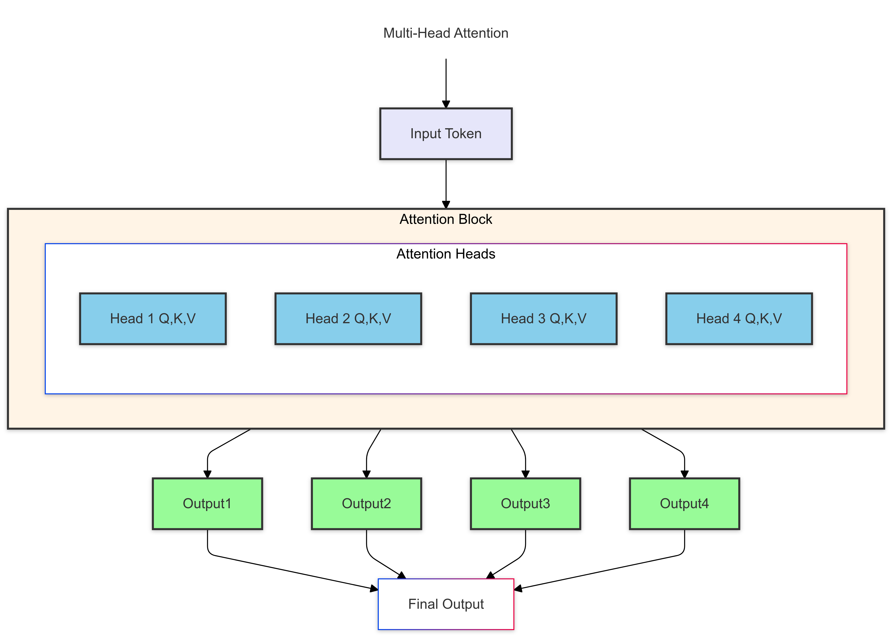
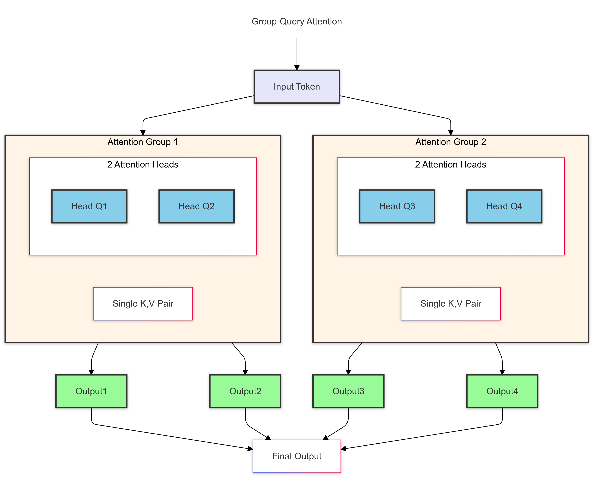

# Primer on Large Language Model (LLM) Inference Optimizations: 3. Model Architecture Optimizations

**Posts in this series**:
1. [Primer on Large Language Model (LLM) Inference Optimizations: 1. Background and Problem Formulation](https://mandliya.github.io/posts/LLM_inference_1/)
2. [Primer on Large Language Model (LLM) Inference Optimizations: 2. Introduction to Artificial Intelligence (AI) Accelerators](https://mandliya.github.io/posts/LLM_inference_2/)
3. **Primer on Large Language Model (LLM) Inference Optimizations: 3. Model Architecture Optimizations** (this post)

In our journey exploring LLM inference optimization, we've covered significant ground in the previous two posts. Our first post introduced the fundamentals of LLM inference, detailing the transformer architecture and its key components like attention mechanisms and K-V caching. We learned about the two critical stages of inference: the prefill stage (with complexity $O(L \cdot n \cdot d^2 + L^2 \cdot n \cdot h \cdot d)$) and the decoding stage (with complexity $O(n \cdot d^2 + L \cdot n \cdot d \cdot h)$), highlighting how these impact performance and resource utilization.  Note that:
    - $L$ is the sequence length
    - $n$ is the batch size
    - $d$ is the model dimension
    - $h$ is the number of attention heads

We also covered metrics to evaluate LLM inference performance, such as time to first token (TTFT), decoding throughput (tokens per second), end-to-end latency, and maximum request rate (aka QPS).
I highly recommend reading the [first post](https://mandliya.github.io/posts/LLM_inference_1/) to get a solid understanding of the challenges and complexities involved in LLM inference.

Our second post focused on hardware acceleration, introducing AI accelerators as specialized solutions for efficient LLM inference. We explored various types of accelerators (GPUs, TPUs, FPGAs/ASICs) and their key features like parallel processing capabilities, high-bandwidth memory, and support for low-precision arithmetic. We also discussed different parallelism strategies - data, model (tensor and pipeline), and task parallelism - that enable efficient scaling of LLM workloads.

Building on this foundation, this post will explore model architecture optimizations that can significantly improve inference efficiency. We'll focus on techniques that modify the transformer architecture to reduce computational complexity and memory requirements while maintaining model performance. Note that these optimizations as name suggests requires changes in the model architecture and hence needs to be implemented prior to training the model. 

## Group Query Attention (GQA)

Group Query Attention (GQA) is a model architecture optimization that reduces memory and computational costs during inference while maintaining model quality. It was introduced by Google Research in their paper "Fast Transformer Decoding: One Write-Head is All You Need" [1].

### Standard MHA vs MQA vs GQA

In standard Multi-Head Attention (MHA), each attention head has its own Query (Q), Key (K), and Value (V) matrices:

What if we use a single K and V head across all query heads? This is called Multi-Query Attention (MQA). As it leverages repeated computation of K and V, it can be more efficient than Multi-Head Attention (MHA), but it may not capture complex patterns as well and thus sacrifices prediction quality.

Grouped-Query Attention (GQA) strikes a balance between MHA and MQA by sharing single K and V head across multiple query heads. It reduces memory requirements and computational complexity while maintaining model quality.

### Memory Calculation Example

For a model with:
- 32 attention heads
- 8 groups (4 heads per group)
- Head dimension = 128
- Sequence length = 2048
- Using 16-bit floating-point numbers

**MHA Memory per Layer:**
- KV cache size = 2048 × 32 × 128 × 2 × 2 bytes = 33.5 MB

**GQA Memory per Layer:**
- KV cache size = 2048 × 8 × 128 × 2 × 2 bytes = 8.4 MB

This represents a 4x reduction in KV cache memory requirements per layer.

### Impact and Benefits of Group Query Attention

As we can see, GQA offers significant memory savings compared to standard MHA, making it an attractive optimization for LLM inference. What makes GQA particularly attractive is that these memory savings come with minimal trade-offs:

1. **Performance Preservation**: While using fewer parameters than standard multi-head attention, GQA maintains nearly equivalent model quality. This is because the separate Query projections per head still allow the model to capture diverse attention patterns.

2. **Implementation Advantages**: Compared to its cousin Multi-Query Attention (MQA), GQA offers a more practical middle ground. It's simpler to implement while providing better control over the efficiency-performance trade-off through adjustable group sizes.

3. **Hardware Efficiency**: GQA's architecture naturally aligns with modern AI accelerators in several ways:
	- **Improved Memory Utilization**: GQA’s shared Key-Value (KV) heads reduce the memory footprint per device, allowing for better cache utilization and enabling larger models to fit within the memory constraints of accelerators like A100 GPUs.
	- **Parallel Computation Efficiency**: The architecture maintains separate Query (Q) projections for each head, enabling fully parallel computation of the Query matrices while reusing the shared KV heads, effectively leveraging the parallel processing capabilities of GPUs and TPUs.
	- **Optimized Memory Bandwidth**: By reusing KV caches across multiple query heads, GQA significantly reduces the memory bandwidth requirements. This leads to lower data transfer overhead and helps decrease latency, especially in distributed multi-GPU setups.
	- **Efficient Workload Distribution**: GQA’s grouped KV heads structure allows for even distribution of the workload across devices (e.g., 8 A100 GPUs handling 8 KV heads), minimizing inter-device communication and enabling efficient batch processing, which results in better overall hardware utilization.
These characteristics make GQA particularly valuable in production environments where serving large language models at scale is challenging.

### Challenges and Considerations
While GQA offers significant benefits, it's essential to consider the following challenges:
- **Query Diversity**: Grouping too many heads together can limit the diversity of query vectors, potentially reducing the model's ability to capture complex patterns in the data. Careful tuning of the group sizes is crucial to balance memory savings with model quality.
- **Training Overhead**: Implementing GQA requires modifications to the transformer architecture and training process. This can introduce additional complexity and training overhead, especially when fine-tuning existing models.

## Mixture of Experts (MoE): Making LLMs Smarter and More Efficient

Mixture of Experts (MoE) represents one of the most innovative architectural optimizations in modern LLMs. Instead of having a single massive neural network, MoE divides the model into multiple specialized sub-networks or "experts," each focusing on different aspects of language processing.

### How Does MoE Work?

At its core, MoE transforms the traditional dense Feed-Forward Network (FFN) layer in transformers into a more dynamic and efficient system. It consists of three key components:

1. **Expert Networks**: The model contains multiple specialized FFN networks (experts), each potentially good at different tasks (e.g., reasoning, coding, or creative writing - note that these are just learned behavior during training not explicitly assigned). Each expert is smaller and more focused, making it easier to train and optimize. 

2. **Gating Network**: A smart "traffic controller" that decides which experts to consult for each input token or segment. It uses the input features to determine the relevance of each expert for the current context. This gating mechanism is trainable and adapts to the input data, directing the token to the most relevant expert.

3. **Sparse Activation**: Only a small number (typically 1-2) of experts are activated for each token. This sparse activation significantly reduces the computational and memory cost, as only a fraction of the model is used for each inference step.

*MoE architecture showing the gating network directing input to relevant experts*

### Why MoE Matters for LLM Inference

MoE offers several compelling advantages for inference optimization:

1. **Computational and Memory Efficiency**:
   - Only 1-2 experts are activated per token instead of utilizing the entire network, leading to substantial savings in computational cost.
   - MoE can reduce FLOPs by up to 5-10x compared to a dense model with equivalent total capacity.
   - The reduced memory usage further helps in lowering latency during inference, making it highly efficient for serving large models.
   - Reduced resource usage lead to better throughput and lower latency, making it highly efficient for serving large models.

2. **Better Specialization**:
   - Different experts can implicitly specialize in various domains or tasks, enabling the model to handle diverse queries more effectively.
   - MoE helps mitigate issues like **catastrophic forgetting** in multi-task settings, as separate experts can learn distinct patterns without interfering with each other.
   - This specialization often results in improved quality for domain-specific queries.

3. **Scaling Benefits**:
   - MoE allows for scaling model capacity without proportionally increasing compute requirements, making it easier to train and deploy very large models.
   - Its sparse nature simplifies the distribution of workloads across hardware accelerators (e.g., GPUs or TPUs), reducing the need for intensive inter-device communication. For example, each expert can be assigned to a different GPU, enabling efficient parallel processing. 
   - The gating network also load balances the workload across experts, ensuring optimal resource utilization increases the overall throughput.
   - This efficient use of hardware resources enables higher throughput, especially in large-scale deployments.

### Real-World Applications

MoE has proven its worth in production systems:

- **GPT-4**: While specific details are not publicly disclosed, it’s widely speculated that GPT-4 leverages MoE architecture to enhance efficiency and specialization.
- **Mistral Models**: Mistral AI's Mixtral line of models uses Sparse Mixtures of Experts (SMoE) to achieve state-of-the-art performance in various NLP tasks.

### Potential Challenges
- The increased complexity of MoE models can make training and optimization more challenging.
- Load balancing and expert selection can be tricky, potentially leading to uneven workload distribution, requiring careful tuning.

## Conclusion
In this post, we explored two key model architecture optimizations - Grouped Query Attention (GQA) and Mixture of Experts (MoE) - that can significantly enhance the efficiency and performance of Large Language Model (LLM) inference. GQA offers a practical way to reduce memory and computational costs while maintaining model quality, making it an attractive optimization for LLMs. On the other hand, MoE introduces a novel approach to model specialization and efficiency, enabling large models to scale efficiently and handle diverse tasks effectively.

In the next post, we will delve into system-level optimizations that complement these model-level techniques, providing a holistic view of LLM inference optimization strategies.