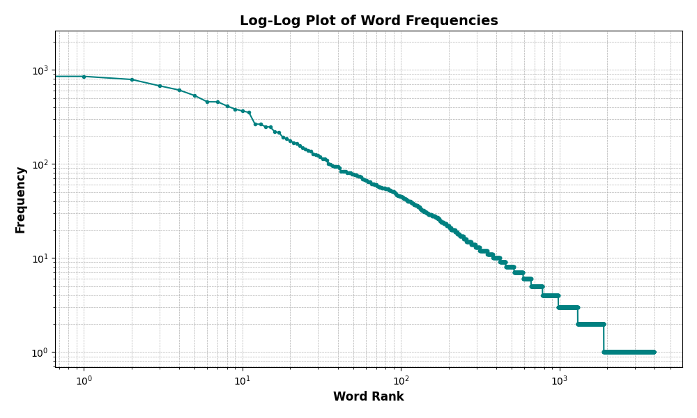

# Scaling Laws in Large Language Models

In this post, we’ll dive into scaling laws in large models and their importance for understanding the relationship between model size, dataset size, computation, and model performance. Scaling laws have become an essential framework in AI, offering empirical guidelines for improving model accuracy through strategic increases in parameters, data, and compute resources.

## Introduction
In AI, it’s commonly accepted that larger models trained on more data tend to perform better. However, this isn’t just intuition—research has shown that the performance improvements from scaling follow predictable patterns, often represented as power-law relationships. These insights into scaling have led to a quantitative framework, helping practitioners make evidence-based decisions on resource allocation.

Scaling laws help answer questions like: How much better will my model perform if I double the data? When does increasing model size yield diminishing returns? Let’s explore the foundational principles and some recent advancements that shape our understanding of scaling laws in AI.

## A Brief History of Scaling Laws in AI
The concept of scaling laws in AI has roots in foundational machine learning theory from the 1980s and 1990s. Researchers like Leslie Valiant and Michael Kearns explored the relationship between model size and performance through the framework of probably approximately correct (PAC) learning and the VC (Vapnik-Chervonenkis) dimension of hypothesis classes. Their work showed that the sample complexity of a learning algorithm—that is, the number of examples required to generalize well—scales with the VC dimension of the hypothesis class, which quantifies the model’s capacity or complexity [1]. While these early scaling insights were focused on the theoretical limits of learning, they laid the groundwork for today’s empirical scaling laws in deep learning, which relate model size, data size, and compute to model performance in more practical, measurable terms.

Recently, scaling laws gained prominence with OpenAI's seminal work in 2020. OpenAI researchers demonstrated that, for large deep learning models, increasing model size, dataset size, and compute resources consistently reduces model loss in a power-law relationship [2].  This work laid the groundwork for quantifying the performance gains achievable through scaling, showing that, under specific conditions, larger models trained with more data and compute can achieve significantly higher accuracy. 

In 2022, DeepMind introduced the Chinchilla scaling law, which refined this understanding by emphasizing the importance of balancing model parameters with dataset size. The Chinchilla findings revealed that, particularly in compute-constrained settings, increasing data often yields greater benefits than increasing model size alone, leading to improved performance and cost-efficiency [3]. These insights underscore the importance of considering the interplay between model size, data size, and compute resources when optimizing large models.

## Power Laws and Scaling in AI

Power law is a functional relationship between two quantities, where one quantity varies as a power of another. Mathematically, it can be represented as: 

$$y = ax^b$$

where $a$ and $b$ are constants. Change in $y$ is directly proportional to the change in $x$ raised to the power of $b$. If $b$ is 2, then when $x$ is doubled, $y$ will be quadrupled. One common example of power law is the area of a square, which is proportional to the square of the length of its sides. As the length of the side of a square is doubled, the area of the square is quadrupled. 

### Power Law Example: Frequency of Words in a Text

Let's consider Zipf's law, a well-known example of a power law in natural language processing. Zipf's law states that the frequency of a word in a text is inversely proportional to its rank in the frequency table. In other words, the most frequent word occurs approximately twice as often as the second most frequent word, three times as often as the third most frequent word, and so on. This relationship can be represented as a power law, where the frequency of a word is proportional to its rank raised to a negative exponent. We can visualize this relationship by plotting the frequency of words against their rank on a log-log scale, where both axes are logarithmically scaled. If the relationship between frequency and rank follows a power law, the data points will lie on a straight line in the log-log plot.

A scaling law in AI is a type of power law that relates a model’s loss (or error) to its properties, such as the number of parameters, dataset size, or compute. Generally, scaling laws are represented by equations of the form:

$$ L(N, D) \propto N^{-\alpha} + D^{-\beta} $$

where:
- $L$ is the model loss
- $N$ is the number of model parameters
- $D$ is the dataset size
- $\alpha$ and $\beta$ are scaling exponents that determine the impact of model size and dataset size on model loss

By fitting this equation to empirical data, researchers can estimate the scaling exponents $\alpha$ and $\beta$ and quantify the impact of model size and dataset size on model performance.

## Chinchilla Scaling Law: Data Over Model Size

One of the most influential scaling laws, the Chinchilla scaling law, emphasizes the importance of data size over mere model size. In experiments, a smaller model (Chinchilla with 70 billion parameters) trained on a larger dataset outperformed a much larger model with 175 billion parameters trained on less data. This insight has encouraged researchers to prioritize dataset growth to enhance model generalization and performance.

The Chinchilla scaling law can be expressed as:

$$L(N, D) = 406.4 N^{-0.34} + 410.7 D^{-0.28} + 
    \underbrace{1.69}_{\text{Irreducible Error}}$$

Where:
- $L(N, D)$ is the loss of the model
- $N$ is the number of parameters in the model
- $D$ is the number of tokens in the training data
- The irreducible error is the minimum loss that can be achieved by the model

This scaling law shows that for compute-constrained scenarios, focusing on high-quality, large datasets can often yield better results than simply expanding model parameters [3].

## Scaling Laws Across Different Modalities

While Chinchilla provides a foundational scaling insight for language models, scaling laws apply across other modalities too. In vision, models show performance gains with scaling, but these gains can plateau sooner than in language models [4]. Similarly, multimodal models that handle text, images, or video present unique scaling behaviors, as their performance depends on cross-modal consistency and complex feature integration [5]

For AI practitioners, this suggests that the scaling approach may vary based on the data type. Multimodal scaling laws are an active research area, aiming to predict the optimal balance for models that blend diverse data types.

## Practical Implications and Limitations of Scaling

While scaling laws are powerful, they come with limitations and practical considerations:

1. **Diminishing Returns**: As model size and dataset size increase, the improvements in performance tend to slow down. This phenomenon, known as diminishing returns, suggests that doubling the model size may not always double the performance gain.

2. **Data Quality**: Scaling is not purely about size—data quality plays a crucial role, particularly at larger scales. Datasets need to be diverse and high-quality to maximize scaling benefits, as noisy or low-quality data can lead to suboptimal outcomes [6].

3. **Compute Constraints**: Compute-Optimal Balance: Scaling laws emphasize finding a balance among model size, data, and compute resources. Compute-optimal scaling means adjusting these factors proportionally rather than maximizing one aspect alone [3].

## Algorithmic Efficiency and Emerging Scaling Strategies

As the cost of training large models continues to rise, researchers are exploring new strategies to achieve similar performance with fewer resources. 

1. **Efficient Architectures**: Architectures like sparse models and mixture-of-experts allow models to use fewer parameters without a loss in performance [7]. These approaches effectively scale model capacity without proportionally increasing compute requirements.

2. **Training Strategies**:  Methods such as transfer learning, curriculum learning, and self-supervised learning can amplify the benefits of scaling by leveraging existing knowledge or structured learning sequences. These techniques reduce the dependency on vast new data while enhancing model robustness and generalization.

These efficiency-focused strategies reflect a shift toward more sustainable scaling practices, enabling large-scale AI without the heavy computational costs.

## Emergent Abilities in Large Models

One intriguing aspect of scaling is the emergence of unexpected abilities in very large models. As models surpass certain parameter thresholds, they often acquire capabilities not explicitly trained for, such as reasoning, arithmetic, or understanding nuanced language cues [8]. These *emergent abilities* highlight that scaling laws are not only about reducing loss but also about expanding the range of tasks that a model can perform.

These emergent abilities provide an exciting research direction, where scaling laws could help predict at what scale models might develop certain skills, guiding future model design.

## Future Directions and Conclusion
As AI research progresses, new scaling strategies and efficiency-focused approaches will likely shape the future of large models. By leveraging emergent abilities and optimizing model design, researchers can unlock the full potential of scaling laws to build more capable, efficient AI systems.

Some open questions and future directions for scaling laws include:
- How does data quality impact scaling limits? Beyond size, identifying the types of data that improve model generalization remains a key area of exploration [6].
- What are limits of emergent abilities in large models, and can scaling laws predict at what scale these abilities plateau or diversify?
- How can scaling laws be applied to multimodal models and other emerging AI paradigms to optimize performance across diverse data types?
- Can we achieve similar performance with smaller, more efficient models? The trend toward parameter-efficient fine-tuning and retrieval-augmented models suggests potential pathways for cost-effective scaling.

In conclusion, scaling laws offer a powerful framework for understanding the relationship between model size, data, and compute in AI. By quantifying the impact of scaling on model performance, researchers can make informed decisions about resource allocation and model design. As AI systems continue to grow in complexity and scale, scaling laws will remain a critical tool for optimizing model performance and efficiency.

## References
1. [A Theory of the Learnable](https://dl.acm.org/doi/10.1145/1968.1972)
2. [Scaling Laws for Neural Language Models](https://arxiv.org/abs/2001.08361)
3. [Training Compute-Optimal Large Language Models](https://arxiv.org/abs/2203.15556)
4. [An Image is Worth 16x16 Words: Transformers for Image Recognition at Scale](https://arxiv.org/abs/2010.11929)
5. [Scaling Laws for Generative Mixed-Modal Language Models](https://proceedings.mlr.press/v202/aghajanyan23a/aghajanyan23a.pdf)
6. [Language Models are Few-Shot Learners](https://arxiv.org/abs/2005.14165)
7. [Switch Transformers: Scaling to Trillion Parameter Models with Simple and Efficient Sparsity](https://arxiv.org/abs/2101.03961)
8. [Emergent Abilities of Large Language Models](https://arxiv.org/abs/2206.07682)
