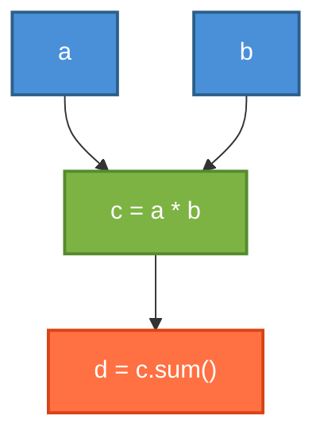
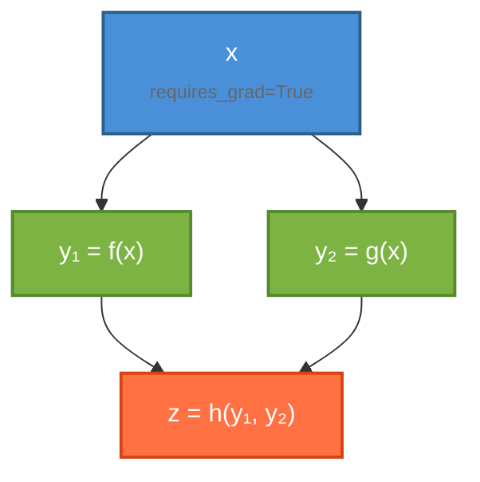
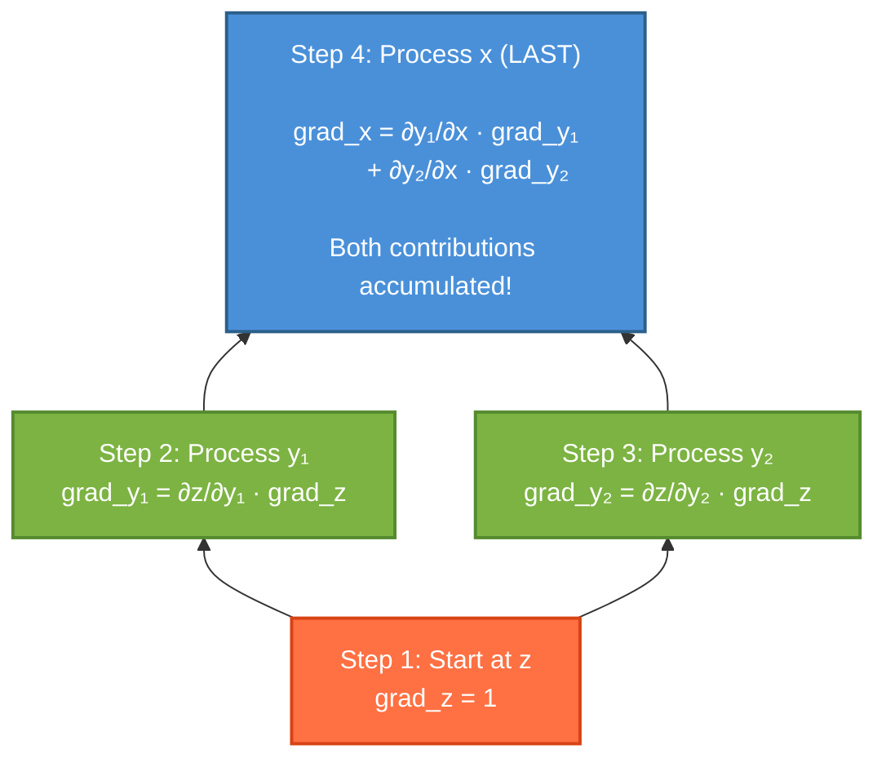
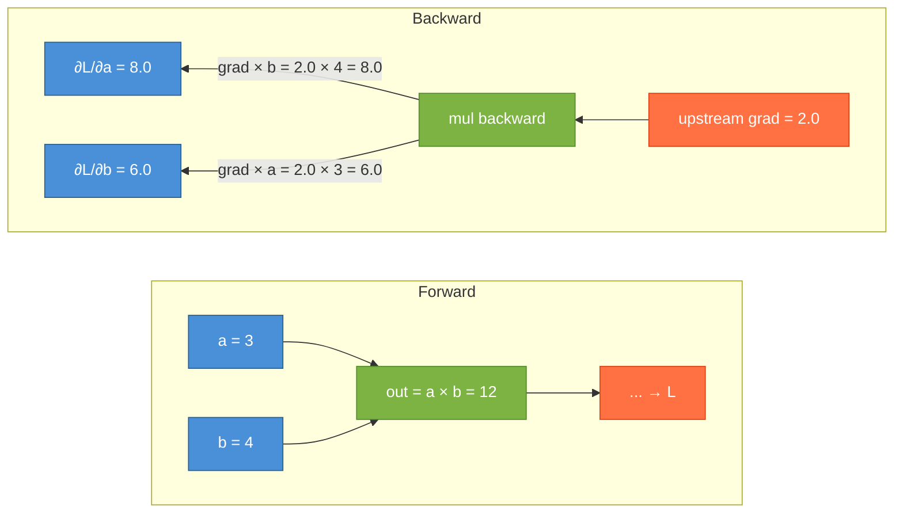
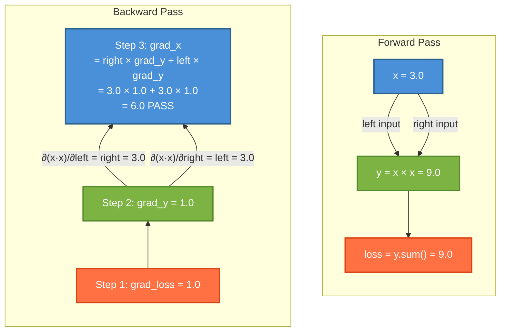

In this series, we are going to build a complete autograd engine from scratch and then use it to build a transformer. No Pytorch or JAX, just pure python and CuPy (Numpy if you don't have GPU). The goal is to deeply understand how automatic differentiation works. This will give us true intuition of what is happening under the hood when we call `loss.backward()` to train our models.

This is part 1, where we build the core `Tensor` class with full backpropagation support. By end of this post, we will train a linear regression model using our own autograd, and we will verify it using numerical gradient checking.

## Why build this?
1. **Understanding**: Calling `loss.backward()` in PyTorch is literally magic until we build it ourselves. Here we will understand how it comes together with chain rule, topological sort, and gradient accumulation.

2. **CuPy as backend**: CuPy mirrors the NumPy API almost perfectly but runs on GPU. By building on CuPy, we get GPU acceleration for free without writing any CUDA code. In absence of GPU, the same code falls back to NumPy with zero changes. Although, our goal is not performance, but understanding how things work under the hood. CuPy also does all the linear algebra under the hood so we can focus on understanding autograd cleanly.

## Computation Graphs and the Chain Rule
The core idea behind automatic differentiation is simple, every computation is a sequence of simple elementary operations (add, multiply, exp, etc), and we know derivative of each one. The chain rule then helps us compose them. When we write:

```python
c = a * b
d = c.sum()
```
We are actually implicitly building a computation graph (a directed acyclic graph, or DAG):



Each node knows:

- **What operation created it?** (multiply, sum etc)
- **Which tensors were its inputs?** (its *parents*)
- **How to push gradients back to its parents?** (the local derivative)

`backward()` walks the graph in reverse from the loss back to the parameters, and apply the chain rule at each step. This is a reverse-mode automatic differentiation and is the magic sauce of training a neural network at scale.

## Backend: CPU/GPU Switching

Before we build the `Tensor`, let's setup a tiny backend module. We'll import `xp` which will be aliased to either `numpy` or `cupy` depending on what's available

```python
!pip install -q cupy-cuda12x   #
```

```python
"""
deeplygrad/backend.py
"""
import os

_requested = os.environ.get("DEEPLYGRAD_BACKEND", "auto").lower()

if _requested == "cupy":
  import cupy as xp
elif _requested == "numpy":
  import numpy as xp
else:
  try:
    import cupy as xp
    xp.array([0])
  except Exception:
    import numpy as xp

BACKEND_NAME = xp.__name__  # "numpy" or "cupy"

def to_numpy(arr):
  """Convert an array to numpy"""
  if BACKEND_NAME == "cupy":
    return arr.get()
  return arr

```


Set `DEEPLYGRAD_BACKEND=cupy` to force GPU, `DEEPLYGRAD_BACKEND=numpy` to force CPU, or leave it as auto.

## The Tensor Class

Now, we will build the `Tensor` class which wraps an `xp.ndarray` and adds the three things:

1. `requires_grad`: Should we track operations on this tensor? This is usually true for a trainable parameter.

2. `_parents`: The tensors which were inputs to the operation that created this tensor.

3. `_grad_fn`: A closure that, given the upstream gradient, pushes gradients to the parents.

```python
"""
deeplygrad/tensor.py - A tensor class with auto-differentiation
"""

from typing import List, Optional, Union, Callable
from deeplygrad.backend import xp, to_numpy
import numpy as np

class Tensor:
  def __init__(self, data, requires_grad: bool = False):
    if isinstance(data, xp.ndarray):
      self.data = data
    elif isinstance(data, np.ndarray):
      self.data = xp.array(data)
    else:
      self.data = xp.array(data, dtype=xp.float64)
    
    self.grad: Optional[xp.ndarray] = None
    self._grad_fn: Optional[Callable] = None
    self._parents: List[Tensor] = []
```


Pretty straightforward so far. The `data` stored is an `xp.ndarray` and we have slots for the gradient and graph metadata. Now, let's add some more properties

```python
@property
def shape(self) -> tuple:
  return self.data.shape

@property
def dtype(self) -> np.dtype:
  return self.data.dtype

@property
def ndim(self) -> int:
  return self.data.ndim

@property
def T(self) -> Tensor:
  return self.transpose()

def numpy(self) -> np.ndarray:
  """Return data as numpy array (moves off GPU if needed)"""
  return to_numpy(self.data)

def zero_grad(self) -> None:
  self.grad = None

def detach(self) -> 'Tensor':
  """Returns a new Tensor sharing data but detached from graph"""
  return Tensor(self.data, requires_grad=False)

def __repr__(self) -> str:
  grad_info = ", requires_grad=True" if self.requires_grad else ""
  return f"Tensor{to_numpy(self.data)}{grad_info}"
```

## The Backward Pass

This is the core of everything we are trying to do. The main idea is:

1. Start from the loss tensor with gradient = 1 (since $\frac{\partial L}{\partial L} = 1$).
2. **Topologically** sort the computation graph.
3. Walk in **reverse** topological order. At each node, call its `_grad_fn` to push gradients to its parents.

### Why do we need to sort topologically?

Consider a tensor `x` that feeds into both `y1` and `y2` which feed into `z`.



The gradient of z with respect to x flows through two paths: one via y₁ and one via y₂. We need both $$\frac{\partial z}{\partial y_1} \cdot \frac{\partial y_1}{\partial x}$$ and $$\frac{\partial z}{\partial y_2} \cdot \frac{\partial y_2}{\partial x}$$ accumulated at x before we can propagate any further back.
Reverse topological order guarantees this, as we will always process a node only after all its consumers have been processed. Here's what that looks like step by step:



If we processed x before y₂ was done, we'd miss half the gradient. Topological sort prevents this.

### Implementation

```python
def backward(self, grad: Optional[xp.ndarray] = None):
  if not self.requires_grad:
    raise RuntimeError(
        "backward() called on a tensor that doesn't require grad"
    )

  # seed gradient
  if grad is None:
    if self.data_size != 1:
      raise RuntimeError(
          f"backward() without a gradient argument is only valid for scalar tensor, got shape: {self.shape}"
      )
    grad = xp.ones_like(self.data)

  # Step 1: Topological sort via DFS
  topo_order: List[Tensor] = []
  visited = set()

  def _build_topo(tensor: Tensor):
    if id(tensor) not in visited:
      visited.add(id(tensor))
      for parent in tensor._parents:
        _build_topo(parent)
      topo_order.append(tensor)

  _build_topo(self)

  # Step 2: Reverse walk — propagate gradients
  self.grad = grad
  for tensor in reversed(topo_order):
    if tensor._grad_fn is not None:
      tensor._grad_fn(tensor.grad)
```

 The entire backward pass is a topological sort followed by a reverse walk. Each `_grad_fn` knows how to compute the local gradient and accumulate it into its parents' `.grad`. Let's see how this works in practice.

 

In this example, we have $a = 3.0$, $b = 4.0$, $c = 1.0$, then we have intermediate tensors $d = a \times b = 12$ and $e = d + c = 13$. The loss is $L = e^2 = 169$.

**Forward pass**: The computation graph is built as operations execute: $a, b \to d$, then $d, c \to e \to L$.

**Backward pass**: We start with $\frac{\partial L}{\partial L} = 1$ and walk the graph in reverse:

1. **Square**: $\frac{\partial L}{\partial e} = 2e = 2 \times 13 = 26$
2. **Addition**: $\frac{\partial L}{\partial d} = \frac{\partial L}{\partial e} \cdot 1 = 26$, and $\frac{\partial L}{\partial c} = \frac{\partial L}{\partial e} \cdot 1 = 26$
3. **Multiplication**: $\frac{\partial L}{\partial a} = \frac{\partial L}{\partial d} \cdot b = 26 \times 4 = 104$, and $\frac{\partial L}{\partial b} = \frac{\partial L}{\partial d} \cdot a = 26 \times 3 = 78$

Each node's `_grad_fn` handles exactly one of these steps. It takes the upstream gradient, multiplies by the local derivative, and accumulates into the parent tensors' `.grad`. The topological sort ensures we process each node only after all its consumers have been processed.

Now, let's implement some operations.

## Operations

 Each operation:
 1. Computes the forward pass (the actual math).
 2. Creates an output `Tensor` with `_parents` and `_grad_fn` set.
 3. The `_grad_fn` closure captures everything it needs to compute the local gradient.

The key idea is the chain rule: to compute how a parameter affects the loss, we multiply the upstream gradient (how much the output affects the loss) by the local derivative (how much the input affects the output):

$$
\frac{\partial L}{\partial \text{input}} = \underbrace{\frac{\partial L}{\partial \text{out}}}_{\text{upstream gradient}} \cdot \underbrace{\frac{\partial \text{out}}{\partial \text{input}}}_{\text{local derivative}}
$$

### Addition

 $$\text{out} = a + b$$

 The gradient of addition with respect to both inputs is 1. So the upstream gradient just passes through.

 $$
 \frac{\partial L}{\partial a} = \frac{\partial L}{\partial \text{out}}.1
 $$

```python
def add(self, other: Union[Tensor, float, int]) -> Tensor:
  other = _ensure_tensor(other) # not here for terseness, check code on github
  out_data = self.data + other.data
  out = Tensor(out_data,
               requires_grad=self.requires_grad or other.requires_grad)

  if out.requires_grad:
    out._parents = [self, other]

    def _backward(grad_output):
      if self.requires_grad:
        g = _unbroadcast(grad_output, self.shape)
        self.grad = self.grad +  g if self.grad is not None else g
      if other.requires_grad:
        g = _unbroadcast(grad_output, other.shape)
        other.grad = other.grad + g if other.grad is not None else g

    out._grad_fn = _backward

  return out
```


Notice two things:

1. **Gradient accumulation**: We do `self.grad = self.grad + g` not `self.grad = g`. This is critical for shared nodes (more on this below).

2. **`_unbroadcast`**: This handles broadcasting, we will explore this too in a moment.

### Multiplication

$$
\text{out} = a \times b
$$

By the product rule:

$$
\frac{\partial L}{\partial a} = \frac{\partial L}{\partial \text{out}}.b
$$

$$
\frac{\partial L}{\partial b} = \frac{\partial L}{\partial \text{out}}.a
$$

Say we have $a = 3$, $b = 4$, so $\text{out} = 12$. And suppose `out` feeds into some larger computation that eventually produces a loss $L$. By the time the backward pass reaches `out`, we already know $\frac{\partial L}{\partial \text{out}}$ that's the **upstream gradient**. Let's say it's 2.0 for this example.

Now we need: what's $\frac{\partial L}{\partial a}$?

**The chain rule says**: multiply the upstream gradient by the local derivative:

$$\frac{\partial L}{\partial a} = \frac{\partial L}{\partial \text{out}} \cdot \frac{\partial \text{out}}{\partial a}$$

**The local derivative** of $\text{out} = a \times b$ with respect to $a$ is just $b$. Think about it: if we hold $b$ constant at 4 and nudge $a$ by a tiny amount $\epsilon$, the output changes by $b \cdot \epsilon = 4\epsilon$. So:

$$\frac{\partial \text{out}}{\partial a} = b = 4$$

Putting it together:

$$\frac{\partial L}{\partial a} = 2.0 \times 4 = 8.0$$

And symmetrically for $b$:

$$\frac{\partial L}{\partial b} = \frac{\partial L}{\partial \text{out}} \cdot a = 2.0 \times 3 = 6.0$$



The intuition: to find how much $a$ affects the loss, ask "if I nudge $a$, how much does $\text{out}$ change?" That's $b$. Then multiply by how much
$out$ affects the loss (the upstream gradient). It's the chain rule applied one link at a time.


```python
def mul(self, other: Union[Tensor, float, int]) -> Tensor:
  other = _ensure_tensor(other)
  out_data = self.data * other.data
  out = Tensor(out_data,
               requires_grad=self.requires_grad or other.requires_grad)
  if out.requires_grad:
    out._parents = [self, other]

    def _backward(grad_output):
      if self.requires_grad:
        g = _unbroadcast(grad_output * other.data, self.shape)
        self.grad = self.grad + g if self.grad is not None else g
      if other.requires_grad:
        g = _unbroadcast(grad_output * self.data, other.shape)
        other.grad = other.grad + g if other.grad is not None else g

    out._grad_fn = _backward
  return out

```

Note that every operation we implement follows almost exactly same pattern: Compute the local derivative, multiply by the upstream gradient and accumulate.

### Matrix Multiplication

$$
C = A @ B
$$

The gradient derivation for matmul is a bit more involved:

$$
\frac{\partial L}{\partial A} = \frac{\partial L}{\partial C} \cdot B^T \qquad \frac{\partial L}{\partial B} = A^T \cdot \frac{\partial L}{\partial C}
$$

Remember, the shapes of the matrices need to work out.  If $A$ is $(m, n)$ and $B$ is $(n, p)$, then $C$ is $(m, p)$. The gradient $\frac{\partial L}{\partial A}$ must be $(m, n)$, and the only way to get that from a $(m, p)$ gradient and a $(n, p)$ matrix is $(m, p) @ (p, n) = (m, n)$ which is $\text{grad} @ B^T$.

```python
def matmul(self, other: Tensor) -> Tensor:
  out_data = self.data @ other.data
  out = Tensor(
      out_data,
      requires_grad=self.requires_grad or other.requires_grad
  )

  if out.requires_grad:
    out._parents = [self, other]

    def _backward(grad_output):
      if self.requires_grad:
        if other.data.ndim == 1:
          g = xp.outer(grad_output, other.data)
        else:
          g = grad_output @ xp.swapaxes(other.data, -1, -2)
        g = _unbroadcast(g, self.shape)
        self.grad = self.grad + g if self.grad is not None else g

      if other.requires_grad:
        if self.data.ndim == 1:
          g = xp.outer(self.data, grad_output)
        else:
          g = xp.swapaxes(self.data, -1, -2) @ grad_output
        g = _unbroadcast(g, other.shape)
        other.grad = other.grad + g if other.grad is not None else g

    out._grad_fn = _backward

  return out

```

### More Operations

We can also write other operations similarly. The class code in github contains `pow`, `exp`, `log`, `sum`, `mean`, `max`, `reshape` and `transpose` and indexing. Each one does the forward math, then sets `_parents` and `_grad_fn` on the output. The key gradient formulas are

| Operation   | Forward      | Local Derivative                                |
| ----------- | ------------ | ----------------------------------------------- |
| `pow(n)`    | $x^n$        | $n.x^{n-1}$                                     |
| `exp`       | $e^x$        | $e^x$                                           |
| `log`       | $ln(x)$      | $\frac{1}{x}$                                   |
| `sum`       | $\sum{x_i}$  | broadcast upstream gradient back to input shape |
| `reshape`   | shape change | reshape gradient back to original shape         |
| `transpose` | axis swap    | swap axes back                                  |


Here is `exp` and `log` as examples:


```python
def exp(self) -> Tensor:
  out_data = xp.exp(self.data)
  out = Tensor(out_data, requires_grad=self.requires_grad)

  if out.requires_grad:
    out._parents = [self]

    def _backward(grad_output):
      g = grad_output * out_data
      self.grad = self.grad + g if self.grad is not None else g

    out._grad_fn = _backward

  return out
```

```python
def log(self) -> Tensor:
  out_data = xp.log(self.data)
  out = Tensor(out_data, requires_grad=self.requires_grad)

  if out.requires_grad:
    out._parents = [self]

    def _backward(grad_output):
      g = grad_output / self.data
      self.grad = self.grad + g if self.grad is not None else g

    out._grad_fn = _backward

  return out
```

And we add Python operator overloads so we can write natural math:

```python
def __add__(self, other):      return self.add(other)
def __radd__(self, other):     return _ensure_tensor(other).add(self)
def __mul__(self, other):      return self.mul(other)
def __rmul__(self, other):     return _ensure_tensor(other).mul(self)
def __sub__(self, other):      return self.sub(other)
def __neg__(self, other):      return self.neg()
def __matmul__(self, other):   return self.matmul(other)
def __pow__(self, exp):        return self.pow(exp)
def __truediv__(self, other):  return self.div(other)

```

## Note on `_unbroadcast`

When we are applying operations on tensors of different but compatible shapes, we often need to handle these subtle cases of mismatches.

Say we are trying to compute $a + b$ where $a$ has shape $(3, 2)$ and $b$ has shape $(2,)$, NumPy will broadcast $b$ along axis 0. The output will have shape $(3, 2)$, and therefore the gradient flowing back will also have shape $(3, 2)$. However $b$ only has shape $(2,)$. We need to sum over the broadcast dimension (axis 0) to get the gradient back to $b$'s shape:

$$\frac{\partial L}{\partial b_j} = \sum_{i=0}^{2} \frac{\partial L}{\partial \text{out}_{ij}}$$


 

This is what `_unbroadcast` does. Note that PyTorch handles this deep inside its C++ backend (ATen). Here we are doing it in Python to make the concept more clear.

```python
def _unbroadcast(grad, target_shape):
  """
  Reduce grad back to target_shape by summing over broadcast dimensions.
  """
  if grad.shape == target_shape:
    return grad

  # Pad target_shape with leading 1s to match grad's ndim
  ndim_diff = grad.ndim - len(target_shape)
  padded_shape = (1, ) * ndim_diff + target_shape

  # Sum over the axes that were broadcast
  reduce_axes = []
  for i, (gs, ts) in enumerate(zip(grad.shape, padded_shape)):
    if ts == 1 and gs > 1:
      reduce_axes.append(i)
    elif ts == 1 and gs == 1 and i < ndim_diff:
      reduce_axes.append(i)

  if reduce_axes:
    grad = grad.sum(axis=tuple(reduce_axes), keepdims=True)

  return grad.reshape(target_shape)
```

## Special Note about the Shared Node

Consider:

```python
x = Tensor([3.0], requires_grad=True)
y = x * x
loss = y.sum()
loss.backward()
```

What should `x.grad` be? Since $y=x^2$, we expect $\frac{\partial y}{\partial x} = 2x = 6.0$

But look at what is happening in the computation graph. $x$ appears twice as both left and right inputs to `mul`.



When `mul`'s `_backward` runs, it pushes two gradients to x:

From the left input: $$\frac{\partial L}{\partial \text{out}} \times \text{right} = 1.0 \times 3.0 = 3.0$$
From the right input: $$\frac{\partial L}{\partial \text{out}} \times \text{left} = 1.0 \times 3.0 = 3.0$$

These accumulate to give $3.0+3.0=6.0$, which is exactly $2x=2\times3=6.0$. So if we had `self.grad = g` instead of `self.grad = self.grad + g`, we would have overwritten the first contribution with second and gotten $3.0$ instead of $6.0$. That is why every `_backward` function does:

```python
self.grad = self.grad + g if self.grad is not None else g
```

And this is why topological sort matters. It ensures both gradient contributions arrive at $x$ before we try to propagate any further.

## Verifying Correctness: Numerical Gradient Checking

How do we know our gradients are correct? We will compare them against the numerical gradients computed via finite difference method.

$$
\frac{\partial f}{\partial x} \approx \frac{f(x + \epsilon) - f(x - \epsilon)}{2\epsilon}
$$

This is probably slow for most operations, but it's a good way to verify our gradients are correct.

```python
def numerical_gradient(tensor: Tensor, f: Callable, epsilon: float = 1e-6) -> Tensor:
  """
  Compute the numerical gradient of a function f with respect to a tensor.
  """
  grad = np.zeros(tensor.shape, dtype=np.float64)
  it = np.nditer(tensor.data, flags=['multi_index'])
  while not it.finished:
    idx = it.multi_index
    original_value = tensor.data[idx]
    tensor.data[idx] = original_value + epsilon
    forward_value = f(tensor)
    tensor.data[idx] = original_value - epsilon
    backward_value = f(tensor)
    grad[idx] = (forward_value - backward_value) / (2 * epsilon)
    it.iternext()
  return Tensor(grad, requires_grad=False)
```

We run this against every operation and check that the analytic and numerical gradients agree to within ~$$10^{-7}$$. Here's the output from our test suite:

```text
Backend: numpy
==================================================

--- Test: Addition ---
  PASS a: max_diff = 2.33e-12
  PASS b: max_diff = 2.33e-12

--- Test: Multiplication ---
  PASS a: max_diff = 2.39e-11
  PASS b: max_diff = 6.99e-12

--- Test: Matrix Multiplication ---
  PASS A (3x4): max_diff = 6.30e-12
  PASS B (4x2): max_diff = 8.18e-12

--- Test: Power ---
  PASS a: max_diff = 1.01e-08

--- Test: Exp + Log ---
  PASS a: max_diff = 2.33e-12

--- Test: Broadcast Addition ---
  PASS a (3x4): max_diff = 6.55e-12
  PASS b (4,): max_diff = 6.99e-12

--- Test: Broadcast Multiplication ---
  PASS a (3x4): max_diff = 5.29e-12
  PASS b (4,): max_diff = 3.81e-12

--- Test: Linear Layer + MSE Loss ---
  PASS W (3x2): max_diff = 1.69e-12
  PASS b (2,): max_diff = 3.22e-12

--- Test: Reshape ---
  PASS a: max_diff = 2.33e-12

--- Test: Transpose ---
  PASS a: max_diff = 2.33e-12

--- Test: Shared Node (x * x) ---
  PASS x: max_diff = 1.27e-11
    x = 3.0, expected grad = 6.0, got = [6.]

--- Test: Multi-step Chain ---
  PASS x: max_diff = 2.05e-10

--- Test: Indexing ---
  PASS a: max_diff = 1.10e-13

--- Test: Max ---
  PASS a: max_diff = 2.33e-12

==================================================
All tests passed!
```
This proves our gradients are correct! Now, let's put it all together and build a linear regression model.

## Putting it all together: Building a Linear Regression Model
Let's use our autograd engine to train on a real dataset. We will use sklearn's California housing dataset (20640 samples, 8 features including median income, house age etc and predicting median house price in $100k).

We standardize the features and split into train and test sets and run a plain SGD with our deeplygrad engine.


```python
from sklearn.datasets import fetch_california_housing
from sklearn.model_selection import train_test_split
from sklearn.preprocessing import StandardScaler

def load_data():
    # Load the California housing dataset
    data = fetch_california_housing()
    X, y = data.data, data.target

    # Split into train and test sets
    X_train, X_test, y_train, y_test = train_test_split(X, y, test_size=0.2, random_state=42)

    # Standardize the features
    scaler = StandardScaler()
    X_train = scaler.fit_transform(X_train)
    X_test = scaler.transform(X_test)

    return X_train, y_train, X_test, y_test
```

Now, let's build the model.

```python
def train_linear_regression(X_train, y_train, X_test, y_test, lr=0.01, epochs=100):
    n_samples, n_features = X_train.shape

    # Convert data to Tensors
    X_train = Tensor(X_train, requires_grad=False)
    y_train = Tensor(y_train, requires_grad=False)
    X_test = Tensor(X_test, requires_grad=False)
    y_test = Tensor(y_test, requires_grad=False)

    # Initialize weights and bias
    W = Tensor(xp.random.randn(n_features), requires_grad=True)
    b = Tensor(0.0, requires_grad=True)

    train_losses = []
    test_losses = []

    for epoch in range(epochs):
        W.zero_grad()
        b.zero_grad()
        y_pred_train = X_train @ W + b
        train_loss = ((y_pred_train - y_train) ** 2).mean()
        train_loss.backward()
        W.data -= lr * W.grad
        b.data -= lr * b.grad
        train_loss = float(train_loss)
        train_losses.append(train_loss)
        y_pred_test = X_test @ W + b
        test_loss = ((y_pred_test - y_test) ** 2).mean()
        test_loss = float(test_loss)
        test_losses.append(test_loss)
        if (epoch + 1) % 10 == 0:
            print(f"Epoch {epoch+1}/{epochs}, Train Loss: {train_loss:.4f}, Test Loss: {test_loss:.4f}")

    return W, b, train_losses, test_losses
```

The loss looks like this:


The loss curve on the left shows both train and test MSE dropping sharply in the first 20 epochs and then gradually plateauing showing gradient descent convergence. The right plot shows the predicted vs actual prices. We can see that our model is able to learn the linear relationship between the features and the price. 

## What we built

Let's recap what we built.
- We built a `Tensor` class with full backpropagation support.
- We implemented all the operations we need for a linear regression model and then some.
- We verified our gradients are correct using numerical gradient checking.
- We built a linear regression model using our autograd engine and trained it on the California housing dataset.
- We plotted the loss curve and the predicted vs actual prices.
- The full code is available on [GitHub](https://github.com/mandliya/simplygrad).

## Key Takeaways
- Automatic differentiation works by recording a computational graph (DAG) during the forward pass, then walking it in reverse topological order to apply the chain rule.
- Every operation stores a `_grad_fn` closure that knows how to push gradients to its inputs (parents). The pattern is always the same: multiply the upstream gradient by the local derivative, then accumulate.
- Gradient accumulation is critical for shared nodes (x * x example).
- Broadcasting is handled by `_unbroadcast` which sums over the broadcast dimensions to get the gradient back to the target shape.
- Numerical gradient checking is a good way to verify our gradients are correct.

## What's next?

In the next post, we'll add the operations needed for real neural networks: ReLU, GELU, softmax, cross-entropy loss, and layer normalization. We'll also build a Module base class and an SGD optimizer, and train a small MLP to make sure everything works. Eventually, we'll build a transformer and train it on a real dataset.
